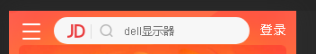
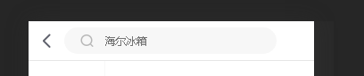
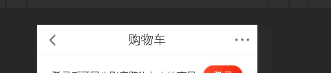

#   1.组件化开发高级-solt
----
我们在使用组件的时候，有时候希望，在组件的内部定制化内容，例如下图:








我们希望定制这样一个header,在不同的页面通过我们的定制，显示不同的效果.  

我们可以通过组件复用的形式，希望把把当前的header分成左中右三部分。

##  1.1 slot插槽的基本使用
> slot基本使用


##  1.2 solt具名插槽的使用
------
具名插槽，就是可以让查抄按指定的顺序填充，而没有具名的插槽是按照你填充的顺序排列的。具名插槽课可以自定义排列


## 1.3作用域插槽的使用
插槽内的数据。是由子组件来提供的
创建组件的时候,在插槽`<slot></slot>`上通过v-bind绑定数据
```html

    <template>
        <slot name="left" v-bind:名字="子组件数据"></slot>
    </template>
```
在父组件中使用的时候。需要把定义时v-bind绑定的值传递给使用的组件模板

```html
    <div id="app">
        <子组件名>
            <!--template新语法,替换子组件中的 slot插槽-->
            <!-- #left是找到对应的插槽 = 接收数据的对象 -->
            <template #left="temp">
                <!-- temp = {名字:子组件数据} -->
                {{temp.名字}}
            </template>
        </子组件名>
    </div>

```
