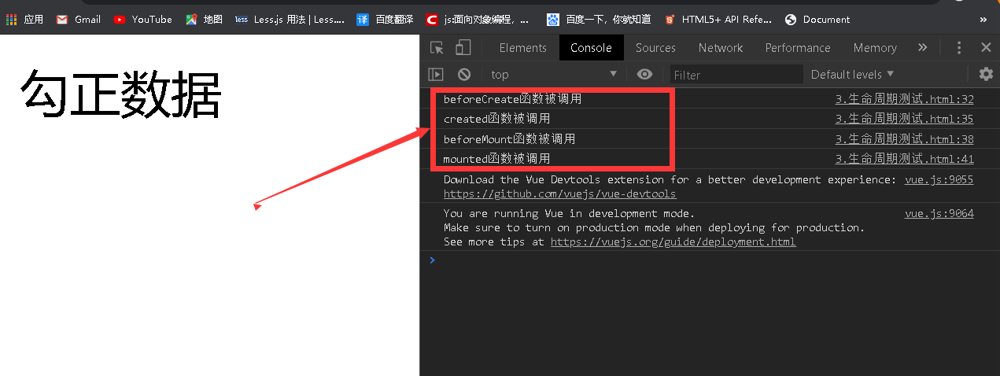

# vue实例的生命周期


在vue实例的生命周期中提供的函数

> 1.beforeCreate()    开始创建  
> 2.created()         创建结束  
> 3.beforeMount()     开始挂载 el  
> 4.mounted()         挂载结束 el  
> 5.beforeUpdate()    开始修改数据  
> 6.updated()         修改数据结束  
> 7.beforeDestory     开始删除(确认删除吗)  
> 8.destoryed()       删除结束  


> 测试代码
```html
<!DOCTYPE html>
<html lang="en" ng-app=" ">
    <head>
        <meta charset="UTF-8">
        <meta name="viewport" content="width=device-width, initial-scale=1.0">
        <meta http-equiv="X-UA-Compatible" content="ie=edge">
        <script src="https://cdn.jsdelivr.net/npm/vue/dist/vue.js"></script>
        <title>Document</title>
    </head>

    <body>
        <div id="app">
            <div>{{message}}</div>
        </div>
        <script>
            var vm = new Vue({
                el:"#app",
                data:{
                    message:"勾正数据"
                },
                //vue实例生命周期的 函数钩子
                beforeCreate(){
                    console.log("beforeCreate函数被调用");
                },
                created(){
                    console.log("created函数被调用");
                },
                beforeMount(){
                    console.log("beforeMount函数被调用");
                },
                mounted(){
                    console.log("mounted函数被调用");
                },
                beforeUpdate(){
                    console.log("beforeUpdate函数被调用");
                },
                updated(){
                    console.log("updated函数被调用");
                },
                beforeDestroy(){
                    console.log("beforeDestory函数钩子被调用");
                },
                destroyed(){
                    console.log("destoryed函数钩子被调用");
                }
            })
        </script>
    </body>

</html>
```
如图所示：




初始化页面依次调用了:
> 1.调用了beforeCreate()钩子函数  
> 2.调用了created()     钩子函数  
> 3.调用了beforeMount() 钩子函数  
> 4.调用了mounted()     钩子函数
----

如图所示:
  
修改数据时调用了
> 1.调用了beforeUpdate()钩子函数  
> 2.调用了updated()     钩子函数

如果所示。在控制台直接输入vm.$destroy()主动销毁实例调用.
  
此时调用了：
>1.beforeDestroy()钩子函数  
>2.destroyed()钩子函数


# 2.vue生命周期的探究

##  2.1 beforeCreate之前
初始化钩子函数生命周期

## 2.2 beforeCreate()和created()钩子函数之间的生命周期
在 beforeCreate()和created()钩子函数之间，进行数据观测,也就是在这个时候开始监控data中的数据变化(包括创建)，同时初始化事件methods

##  2.3 created钩子函数和BeforeMount之间的声明周期


> 对于created钩子函数和BeforeMount钩子函数有判断:

### 2.3.1 el选项对生命周期有影响

> 有el选项

```javascript
    var vm = new Vue({
        el:"#app",
        data:{message:"勾正数据"},
        //vue实例生命周期的 函数钩子
        beforeCreate(){     console.log("beforeCreate函数被调用");  },
        created(){          console.log("created函数被调用");       },
        beforeMount(){      console.log("beforeMount函数被调用");   },
        mounted(){          console.log("mounted函数被调用");       }
    })
```


----

> 2. 无el选项


结果:
>实践证明：没有el选项，则停止编译，也意味着暂时停止了生命周期，生命周期到created钩子函数就结束了
>而当我们不加el选项，但是手动执行vm.$mount("element.ID")方法的话，也能够使生命周期进行下去.例如
```javascript
   var vm = new Vue({
        el:"#app",
        data:{message:"勾正数据"},
        //vue实例生命周期的 函数钩子
        beforeCreate(){     console.log("beforeCreate函数被调用");  },
        created(){          console.log("created函数被调用");       },
        beforeMount(){      console.log("beforeMount函数被调用");   },
        mounted(){          console.log("mounted函数被调用");       }
    }) 
    vm.$mount("#app")
```


### 2.3.2   template

>同时使用template和html,查看优先级

```html
<!DOCTYPE html>
<html lang="en" ng-app=" ">
    <head>
        <meta charset="UTF-8">
        <meta name="viewport" content="width=device-width, initial-scale=1.0">
        <meta http-equiv="X-UA-Compatible" content="ie=edge">
        <script src="https://cdn.jsdelivr.net/npm/vue/dist/vue.js"></script>
        <title>生命周期中-template和html的优先级</title>
    </head>

    <body>
        <h1>测试template和html的优先级</h1>
        <div id="app">
            <div>{{message}}</div>
        </div>
        <script>
            var vm = new Vue({
                el:"#app",
                data:{
                    message:"勾正数据"
                },
                template:"<p>这是一个template模板</p>"
            })
        </script>
    </body>

</html>
```


>结论:
1.如果vue实例对象中，有template参数选项，则将其作为模板编译成render函数
2.如果没有template参数选项，则将外部的html作为模板编译(template),也就是说，template参数选项的优先级要比外部的html高


##  2.4 beforeMount和mounted钩子函数间的声明周期
----
```html
<!DOCTYPE html>
<html lang="en" ng-app=" ">
    <head>
        <meta charset="UTF-8">
        <meta name="viewport" content="width=device-width, initial-scale=1.0">
        <meta http-equiv="X-UA-Compatible" content="ie=edge">
        <script src="https://cdn.jsdelivr.net/npm/vue/dist/vue.js"></script>
        <title>5.生命周期-beforeMount钩子函数.html</title>
    </head>

    <body>
        <div id="app">
            <div>{{message}}</div>
        </div>
        <script>
            var vm = new Vue({
                el:"#app",
                beforeCreate(){
                    console.log("beforeCreate函数被调用");
                },
                data:{
                    message:"勾正数据"
                },
                created(){
                    console.log("created函数被调用");
                },
                beforeMount(){
                    console.log(this.message);
                    this.message="张三";
                    console.log("beforeMount函数被调用");
                },
                mounted(){
                    console.log("mounted函数被调用");
                }
            })
        </script>
    </body>

</html>
```
> beforeMount载入前(完成了data和el数据的初始化),但是当前页面中的内容还是vue中的占位符({{message}}),data中数据message信息还没有被挂在到Dom节点中，在这里可以在渲染数据前，做最后一次的更改数据的机会，并且不会触发其他钩子函数，一般可以在这里做初始数据的获取.

>mounted载入后html已经被渲染，这个钩子函数操作会把vue实例中的data里的messsage挂在到DOM节点中去

##  2.5 beforeUpdate 和updated 钩子函数间的生命周期

在vue中，修改数据会导致页面重新渲染，一次调用beforeUpdate和updated钩子函数

如果数据/待修改数据没有被载入到template或者html模板中，则不会调用这两个钩子函数

如：
```html
<!DOCTYPE html>
<html lang="en" ng-app=" ">
    <head>
        <meta charset="UTF-8">
        <meta name="viewport" content="width=device-width, initial-scale=1.0">
        <meta http-equiv="X-UA-Compatible" content="ie=edge">
        <script src="https://cdn.jsdelivr.net/npm/vue/dist/vue.js"></script>
        <title>brforeUpdate和updated</title>
    </head>

    <body>
        <div id="app">
            <div>{{message}}</div>
        </div>
        <script>
            var vm = new Vue({
                el:"#app",
                data:{
                    message:"勾正数据"
                },
                beforeUpdate(){
                    console.log("beforeUpdate");
                },
                updated(){
                    console.log("update");
                },
                template:"<h1>这是一个h1标记</h1>"
            })
        </script>
    </body>
</html>
```


在f12中通过`vm.message = "aaaa"`来修改vue实例中的数据，则变化如下，没有触发钩子函数


如果template或者html模板绑定了数据，则会触发

```html
<!DOCTYPE html>
<html lang="en" ng-app=" ">
    <head>
        <meta charset="UTF-8">
        <meta name="viewport" content="width=device-width, initial-scale=1.0">
        <meta http-equiv="X-UA-Compatible" content="ie=edge">
        <script src="https://cdn.jsdelivr.net/npm/vue/dist/vue.js"></script>
        <title>brforeUpdate和updated</title>
    </head>

    <body>
        <div id="app">
            <div>{{message}}</div>
        </div>
        <script>
            var vm = new Vue({
                el:"#app",
                data:{
                    message:"勾正数据"
                },
                beforeUpdate(){
                    console.log("beforeUpdate");
                },
                updated(){
                    console.log("update");
                },
                template:"<h1>这是一个h1标记{{message}}</h1>"
            })
        </script>
    </body>
</html>
```


在f12中通过`vm.message = "张三"`来修改vue实例中的数据，则变化如下，message被渲染到页面后就会触发钩子函数


## 2.6 beforeDestroy和destroyed

在vm.$destroy()方法调用时，就会触发beforeDestroy(),在销毁前先执行beforeDestroy(),在执行vm.$destroy(),然后在执行destroyed()

一般在beforeDestroy()做善后处理:清除定时器，清除非指令绑定事件等等
销毁后：destroyed() 卸载watcher,事件监听,子组件

# 总结：

----
-   beforeCreate：可以在这里加loading事件
-   created:在这里结束loading,做数据处理的获取。实现函数自执行
-   mounted:在此处发送后端请求，那会数据，配合路钩子函数由做事情
-   beforeDestroy: 是否确认删除?
-   destroyed:清空相关内容
 