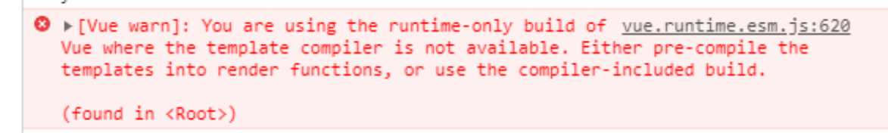

# 1.使用webpack打包vue 项目

## 1.1 webpack 配置

不会了 自己去查，

## 1.2 vue安装

>cnpm install vue -D    本地安装  
>cnpm install vue -g    全局安装  

> index.js
```js
//引入vue
import Vue from "vue"
const app = new Vue({
    el:"#app",
    data:{
        message:"勾正数据
    }
})
```
> index.html
```html
    <div id="app">
        {{message}}
    </div>    
```

>在终端中进行webpack打包  

1.如果没有配置webpack.config.js 文件  则使用webpack打包命令：
```
    webpack ./src/js/index -o ./dist/index.js    
```

2.配置过webpack.config.js的 可以直接使用webpack打包
```
    webpack
```
3.一般配置情况下。都会在`package.json`中的scripts中配置打包命令
```json
    "script":{
        "build":"webpack --config xxxx.js"
    }
```
 具体区分环境变量打包的配置,可以查询webpack环境变量区分的笔记文件  
 当前情况下。我们只需要使用`"build":"webpack"`即可


在引入vue文件打包后，启动html页面查看结果发现vue在页面渲染的地方是没有任何显示的。正常情况下，在console中会有报错。当前不报错可能是因为vue版本问题有修正  



此时,在查看index.html的时候，发现console中报vue错误,错图提示我们，正在使用`runtime-only`构建项目，不能将template模板编译.  

>   1.runtime-only模式,代码中不可以有任何的template存在。因为无法解析  
>   2.runtime-complier模式，代码中可以有template,因为conplier可以用于编译template,在webpack中配置，设置指定使用`runtime-complier`模式. webpack.config.js中更改  

```js
    //解析
    resolve:{
        modules:{},
        alias:{
            "vue$":"vue/dist/vue.esm.js"
        },
        mainFields:[],
        mainfiles:[]
        extensions:[]
    }
```

重新打包,查看index.html页面   


#   2 如何分布抽取实现vue模块

>   创建vue的template和el之间的关系
>   el表示挂载元素的挂载点
>   template里面html会将挂载点的内容替换，一般我们使用vue是开发单页面富应用(single page application),只有一个index.html,而且index.html都是简单结构

```html
    <!DOCTYPE html>
    <html lang="en">
    <head>
        <meta charset="UTF-8">
        <meta name="viewport" content="width=device-width, initial-scale=1.0">
        <title>Document</title>
    </head>
    <body>
        <div id="app">
        </div>
        <script src="../dist/index.js"></script>
    </body>
    </html>
```

##  2.1.    第一次抽取,使用`<template>`替换`<div id="app"></div>`

> 20200605>src>js>index.js文件
```js
const app = new Vue({
    data:{
        message:"勾正数据",
        cmsg:"子组件的cpn"
    },
    template:`
        <div>
            <h2>这是一个标题</h2>
            <p class="red">{{cmsg}}</p>
            <button  @click="btnClick">按钮</button>
        </div>
    `,
    methods:{
        btnClick(){
            console.log("按钮被点击");
        }
    }
}).$mount("#app")

```
使用了template模板替换挂载的id为app的div元素，此时不需要修改HTML代码，只需要修改js中template. 再次打包,查看结果


##  2.2第二次抽取，使用组件化思想替换`templatte`
考虑第一次抽取。写在index.js中vue的template代码太冗余

> 把vue实例中的template在index.js中单独创建
```js
    const Cpn ={
        template:`
            <div>
                <h2>这是一个标题</h2>
                <p class="red">{{cmsg}}</p>
                <button  @click="btnClick">按钮</button>
            </div>
        `,
        data(){
            return {
                cmsg:"子组件的cpn"
            }
        },
        methods:{
            btnClick(){
                console.log(this.cmsg);
            }
        }
    }
```
> 修改index.js中vue实例中注册组件，并使用组件
```js
    new Vue({
        el:"#app",
        data:{
            message:"勾正数据"
        },
        components:{
            //注册局部组件
            Cpn // Cpn:Cpn es6语法简写
        },
        template:"<Cpn/>"
    })
```
>再次使用webpack打包,成功后显示和使用template替换div的效果是一样的


## 2.3 第三次抽取组件对象。把组件封装到新的文件中，并使用模块化导入app.vue
我们使用app.vue分离了模板、样式、行为,但是我们不可能让所有的模板和样式都在一个vue文件内，所以需要使用组件化的方式

> vue组件化模板的基本格式(xxx.vue)

```vue
    <template>

    </template>
    <script type="text/ecmascript-6">
    
    </script>
    <style scoped>
        /*scoped的作用是在当前模板内使用样式*/
    </style>
```

> 因为在vue组件化模板中。有css样式、js文件、template模板的使用，以及webpack不能直接解析vue文件,所以需要在package.json,中配置如下选项


>注意： `vue-loader`的版本需要匹配vue的版本,所以以后开发时，应先查看当前使用的vue版本，在根据vue版本查看对应的vue-loader(自行百度),每个vue的版本发布，都会有对应的`vue-loader`和`vue-template-compiler`.


>修改结束后，直接在当前文件目录的终端中运行 `cnpm install`命令，重新载入package.json的配置

>  20200605>src>components>app.vue

```vue
    <template>
        <div>
            <h2>这是一个标题</h2>
            <p class="red">{{cmsg}}</p>
            <button  @click="btnClick">按钮</button>
        </div>
    </template>
    <script>
        export default{
            name:"cpn",
            props:["msg"],
            data(){
                return {
                    cmsg:"子组件的cpn"
                }
            },
            methods:{
                btnClick(){
                    console.log(this.msg);
                }
            }
        }
    </script>
    <style scope>
        .red{
            background-color:red;
        }
    </style>
```

>   20200605>src>js>index.js

```js
    import Vue from "vue"      //"vue/dist/vue.esm.js"
    import App from "../components/app.vue"
    // console.log(Vue)
    const app = new Vue({
        data:{
            message:"勾正数据"
        },
        template:`<app/>`,
        components:{
            app:App
        }
    }).$mount("#app")
```

再次打包，查看index.html,app.vue被vue组件解析


>如果你在使用es6语法导入模块的时候，想要简写，例如这样省略.vue后缀

```js
    import App from "../components/app"
```

可以再webpack.config.js中配置
```js
    resolve:{
        //导入模块简写省略的后缀,会在当前配置下，按顺序查找文件
        extensions:['.js','.css','.vue']
        //别名
        alias:{
            "vue$":"vue/dist/vue.esm.js"
        }
    }
```


#   3.打包index.html

> cnpm install html-webpack-plugin -D

使用插件，修改webpack.config.js文件中的plugin部分

```js
//获取htmlWebpackPlugin对象
const htmlWebpackPlugin = require("html-webpack-plugin")

//配置：
module.exports={
    ....
    plugin:[
        new htmlWebpackPlugin({
            template:__dirname + "/src/index.html",
            filename:'index.html',
            minify:{
                removeAttribute...:true,//删除属性中使用的""，   "1,2"个别情况不能删除
                collapseWhitespace:true
            }
        })
    ]
}
```


#   4.webpack运行环境分离
----
> cnpm install webpack-merge -D

##  4.1 公共环境    base

> webpack.base.conf.js
```js
//webpack基础配置文件
const path  = require('path')
// console.log(__dirname);  
// console.log(path);  
// console.log(path.resolve());  
// console.log(path.resolve(__dirname));  
// console.log(path.resolve('./src/index.html'));  
const VueLoaderPlugin = require("vue-loader/lib/plugin")
const htmlWebpackPlugin = require('html-webpack-plugin')
module.exports={
    entry:{
        index:path.resolve(__dirname,'../src/js/index.js')
    },
    resolve:{
        alias:{
            "vue$":"vue/dist/vue.esm.js"
        }
    },
    module:{
        rules:[
            {
                test:/\.vue$/,
                loader:"vue-loader"
            },{
                test:/\.css/,
                use:[
                    "style-loader",'css-loader'
                ]
            },{
                test:/\.js/,
                use:{
                    loader:'babel-loader',
                    options:{
                        presets:["@babel/preset-env"]
                    }
                }
            }
        ]
    },
    plugins:[
        //确保引入了 这个插件
        new VueLoaderPlugin(),
        new htmlWebpackPlugin({
            template:path.resolve("./src/index.html"),
            // template:"./src/index.html",
            filename:'index.html'
        })
    ]
}
```  
  
##  4.2 开发环境    development
> webpack.dev.conf.js

```js
// 开发模式
const path = require('path')
const {smart} = require("webpack-merge")
const baseConfig = require("./webpack.base.conf")
module.exports = smart( baseConfig , {
    mode: "development",
    output:{
        path:path.resolve(__dirname,'../dist'),
        filename:"[name].js"
    }
})
```
##  4.3 工厂环境    production

> webpack.prod.conf.js
```js
//工厂模式

const path = require('path')
const {smart} = require("webpack-merge")
const baseConfig = require("./webpack.base.conf")
module.exports = smart( baseConfig , {
    mode: "production",
    output:{
        path:path.resolve(__dirname,'/js'),
        filename:"[name].js"
    },
})
```

>   4.4 配置打包简写语句

>在package.json中修改 scripts的值

```json
    scripts:{     
        "dish": "webpack --config ./build/webpack.dev.conf.js",
        "build": "webpack --config ./build/webpack.prod.conf.js"
    }
```

#   5.搭建/运行本地服务

> cnpm install webpack-dev-server -D

>   webpack.dev.conf.js

```js
const path = require('path')
const {smart} = require("webpack-merge")
const baseConfig = require("./webpack.base.conf")
module.exports = smart( baseConfig , {
    mode: "development",
    output:{
        path:path.resolve(__dirname,'../dist'),
        filename:"[name].js"
    },
    //定义webpack-dev-server
    devServer: {
        contentBase: "./dist",//设置服务运行的index文件的位置
        port: 4000,
        historyApiFallback: true
    }
})
```
> 定义本地服务运行 代码
```json
    "scripts": {
        "test": "echo \"Error: no test specified\" && exit 1",
        "dish": "webpack --config ./build/webpack.dev.conf.js",
        "build": "webpack --config ./build/webpack.prod.conf.js",
        //定义运行服务的代码，通过npm start 或者npm run start来启动服务
        //注释不能出现在json文件中，复制进去后请删除
        "start": "webpack-dev-server --config ./build/webpack.dev.conf.js"
    }
```