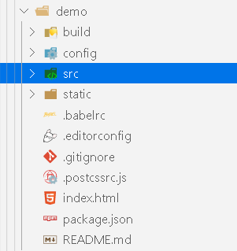
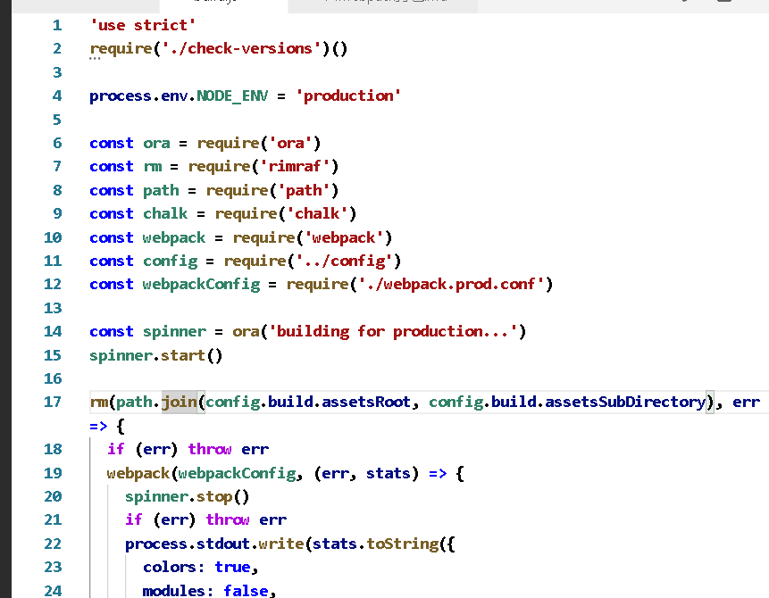
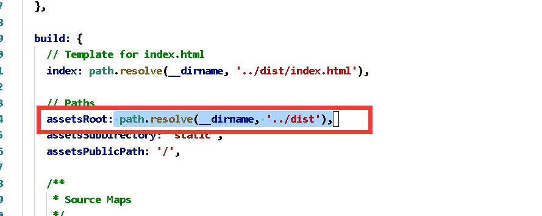
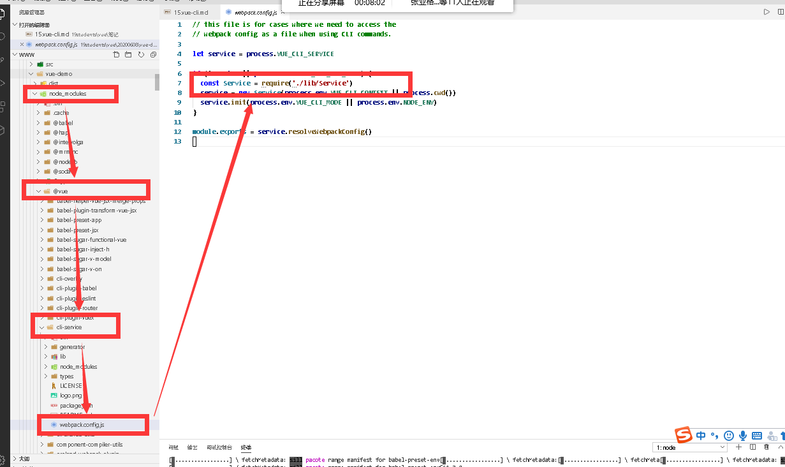

# 1.vue-cli起步

##  1.1什么是vue-cli  (@vue/cli 4.4.1)
Vue CLI 是一个基于vue.js快速开发的完整系统，提供：
-   通过`@vue/cli`搭建交互式的项目脚手架
-   通过`@vue/cli` + `@vue/cli-service-global`快速开始零配置原型开发
-   一个运行时依赖 `@vue/cli-service`的开发(组件),该依赖：
    +   可升级
    +   基于webpack构建，并带有合理化的默认配置
    +   可以通过项目内的配置文件进行配置
    +   可以通过插件进行扩展
-   是一个丰富的官方插件集合，集成了前端开发中最好的工具
-   一套完整的图形化创建和管理vue.js项目的用户界面

致力于工具基础标准化，确保了各种构建工具能够基于智能的默认配置，让各类构建工具平稳衔接，这样，开发者能更好的专注于撰写应用上，而不是花费时间去纠结配置,

##  *1.2 *CLI是什么意思？**

- CLI是 Command-Line Interface，即命令行界面，也叫脚手架

## **1.3  vue cli的使用**
vue cli依赖node.js环境，vue cli 就是使用了webpack的模板

安装脚手架
> npm install -g @vue/cli  
> cnpm install -g @vue/cli

安装完使用命令查看版本
> vue --version


**拉取2.x版本(旧版本)**

> npm install -g @vue/cli-init
使用的还是高版本的vue/cli，想用`vue init`,做一个全局的桥接工具

> **2.x创建项目(基于webpack3开发打造的)**
```
    vue init webpack vueDemo
```
> **3.x以上的版本使用：基于webpack4打造的**
```cmd  
    vue create webpackDemo
```
>  vue图形化界面创建
```cmd
    vue ui
``` 
## **1.4 创建工程的选项含义**：

> `vue-cli3   `
-   project name:项目名称(默认)
-   projcet description:描述
-   vue build:
    +   runtime+compiler:大多数人都使用这个。可以编译template模板
    +   runtime-only:比compiler模式少6kb,并且效率更高，直接使用render函数
-   install vue-router:是否安装路由
-   eslint:是否使用规范     --------------基本配置   手动配置    自我创建 
-   unit tests:是否使用unit测试
-   ...测试..  e2e  点到点测试
-   你使用哪种包管理(3选一)
    +   npm
    +   yarn
    +   自己管理


# **2.目录结构**
----


目录中build和config都是相关的配置文件

## 2.1 
    build中将webpack的配置文件做了分离：

+   `webpack.base.conf.js` (公共环境配置)
+   `webpack.dev.conf.js` (开发环境配置)
+   `webpack.prod.conf.js` (生产环境配置)


>查看package.json
打包构建命令：
```
npm run build  
```
该命令执行了build文件夹下边的build.js文件

访问查看build.js文件

```js
//模式为生产模式
process.env.NODE_ENV = 'production'
//引入了config文件夹中的index.js配置文件
//index.js中定义了开发环境和生产环境中使用的变量
const config = require('../config')
// 引入生产环境配置
const webpackConfig = require('./webpack.prod.conf')

//rm 相当于remove，移除已存在的build打包后的文件，
//移除出错则抛出异常err
//没有错误，webpack执行配置文件打包
// webpack(webpackConfig,()=>{})
rm(......,(err)=>{})
```

通过npm run build 会生成一个dist的文件夹,build.js文件中的rm操作可以理解为直接删除dist文件夹
如何看出build打包的文件是放在dist文件中的。
> webpack.prod.conf.js中

```js
output: {
    //文件输出路径
    path: config.build.assetsRoot,
    filename: utils.assetsPath('js/[name].[chunkhash].js'),
    chunkFilename: utils.assetsPath('js/[id].[chunkhash].js')
  }
```
config是在配置文件中引入的一个index.js文件,文件返回的build中有一个assetsRoot值。



##  2.2 src和static
src 源码目录
static  是防止静态资源的地方，static文件夹下的资源会原封不动的打包复制到dist文件夹下

## 2.3 其他相关文件

### 3.2.1   babelrc
.babelrc是es代码相关转化的配置
```js
  "presets": [
    ["env", {
      "modules": false,
      "targets": {
        "browsers": ["> 1%", "last 2 versions", "not ie <= 8"]
      }
    }],
    "stage-2"
  ],
  "plugins": ["transform-vue-jsx", "transform-runtime"]
}

```
1.browsers 表示需要适配的浏览器`"> 1%"`表示份额大于1%,`"last 2 versions"`最后的2个版本(最新),`not ie <= 8`不需要适配ie8及以下版本
2.plugins 指定babel需要的插件


###  2.3.2  editorconfig
.editorconfig是编码配置文件
```
root = true  
[*]  
charset = utf-8  
indent_style = space  
indent_size = 2  
end_of_line = lf  
insert_final_newline = true  
trim_trailing_whitespace = true  
```

代码缩进空2格，是否清楚空格


### 2.3.3   .eslintignore文件

.eslintignore 忽略一些不规范的代码文件

/build/
/config/
/dist/
/*.js
/test/unit/coverage/


### 2.3.4   .geiignore文件
.geiignore 是git忽略的文件和提交忽略的文件

### 2.3.5   .postcssrc.js文件
css转化的配置

### 2.3.5   package.json  和 package-lock.json

1.package.json(包管理,记录的大概安装的版本)
2.package-lock.json(记录的真实安装版本)


# 3.runtime-compiler 和runtime-only

runtime-only 使用render() 渲染页面

> app.vue
```vue
    //把 当前的vue文件 当做返回值返回
    <template>
    </template>
    <script>
    export default {
        name:"app"
    }
    </script>
    <style scope> </style> 
```

>main.js

```js
    import App from "./app"
    new Vue({
        el:"#app",
        data:{

        },
        render: (h) =>{
            h(app)
        }
    })
```

runtime-compiler 使用components 注册组件  template渲染页面

> app.vue
```vue
    //把 当前的vue文件 当做返回值返回
    <template>
    </template>
    <script>
    export default {
        name:"app"
    }
    </script>
    <style scope> </style> 
```

> main.js

```js
    import Vue from 'vue'
    import App from './App'
    new Vue({
    el: '#app',
        template:'<app/>',
        components:{
            app:App
        }
    })
```

不同的地方就是 使用render() 函数代替了components的注册和template的渲染

>   runtime-compiler如何解析template组件   
```
    template模板组件解析为 ==>ast(抽象语法树)==>然后在编译成render()函数==>渲染成虚拟的DOM==>真实DOM渲染
```

>   runtime-only 如何解析template组件
```
   render()函数==>渲染成虚拟的DOM==>真实DOM渲染 
```
当使用`eslint`检测js语法的时候，`render()`函数中的语法书写方式会报错

可以更改 config 文件夹下 index.js文件中的 **`useEslint = true`** 改成 **`useEslint = false`**,关闭掉eslint规范,重新运行项目,即可使用


#   4.  vue-cli3

## 4.1  vue.cli3起步
vue-cli3与2的却别
+   3基于weboacj4， 2基于webpack3
+   3的设计原则是'0配置' 移除了配置文件 build 和config
+   3提供了vue-ui的命令。提供了可视化配置
+   移除了static新增了public文件夹，并将index.html移入了publick文件夹


-   public类似static文件夹，里面的资源会原封不动的打包
-   src源码文件夹，npm run serve运行服务的时候，打开浏览器输入localhost:8080打开的是src下的main.js


`Vue.config.productionTip = false`构建信息是否显示。


vue ui  视图界面 ----配置选项，依赖插件，任务      简化了工作命令的一些使用。


> 如果需要在項目目录中查找到配置文件，如下图



vue-cli3的设计原则就是0配置。本身就是不想让你修改/找到这些文件.
如果必要性的需要修改。
则。在你当前的vue-cli3项目中创建vue.config.js,注意：文件名称必须为vue.config.js
vue-cli3会自动扫描此文件，根据此文件修改配置文件

在vue.config.js中 通过module.exports返回自定义的配置文件

```js
    module.exports={
        //修改的配置
    }
```
