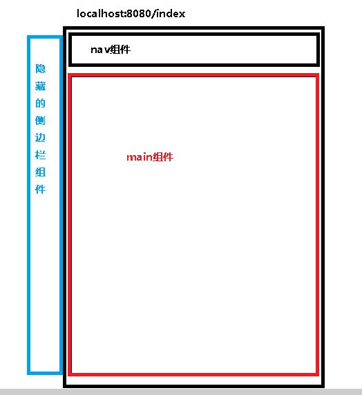

1.路由简介

-----
**什么是路由?**
+   路由就是通过互联网把信息从源地址传送到目的地的活动
+   路由提供了两种机制：路由和传送
    -   路由就是决定数据包从来源到目的地的路径(home/index/main等等)
    -   传送就是数据的转移
+   路由表(映射表)
    -   路由表就是映射表，决定了数据包的指向 --链接那个代码片段(路由跳转)


#   2.前端/后端路由

2.1 后端渲染(服务端渲染)
//php---->生成html+css+js ----xml----页面渲染
jsp---->后端路由,处理url和页面的映射关系 例如springmvc中@requretMapping 映射前端路由页面

2.2 前后端分离(ajax请求数据)
后端只负责提供数据 静态资源服务器(html+css+js) 
前端通过ajax发送网络请求后端服务器(接口),服务器回传数据js，js代码渲染DOM
(整体的页面改变、刷新)

2.3 单页面富应用(SPA页面)
前后端分离加上前端路由 ，前端路由的url映射表不会向服务器请求，前端路由--找通过url映射表找到单独的页面，根据页面本身的ajax请求后端，后端只提供api(接口),api接口只负责响应数据请求，改变url，页面不会进行刷新 

#   3.URL地址 hash 和HTML5 history

##  3.1 URL的 hash 和 href

+   location.href的作用是直接改变当前页面的请求,其本质上改变的是window.location的href属性,页面会从新刷新
+   location.hash的作用也是直接改变window.location的href,但是页面不会刷新,并且hash是通过锚点(#)来改变href属性,就相当于在当前页面查找一个锚标记

>测试：打开vue-cli2的demo,通过location.href改变属性，发现network中的资源会被重新加载，而location.hash改变后，network中只有favicon.ico资源发生了重新请求，其他资源都未请求，结论得出。hash改变url是不会刷新页面的


vue-router 其实使用的就是hash这样的机制，改变url地址，这个URL地址存在一份路由映射表里面,例如，比如/user代表要请求的用户页面，在路由映射表中配置有/user路由表(路由关系),就可以在前端跳转而不刷新页面，所有数据请求都走ajax

##  3.2 html5的history模式
----

>   history.pushState({},"","/bbb")    
>   history.replaceState({},"","/bbb") 

history类似于数组的使用。 
    pushState相当于数组的push方法,入栈操作

    replaceState相当于数组的替换方法，不进行入栈操作

> go 只能在pushState模式中使用。go是前进后退到那个历史页面

history.go(-1) //回退一个页面
history.go(1)   //前进一个页面
history.forward()   //等价于go(1)
history.back()  //等价于go(-1)


# 4.vue-router的安装配置
----
1.安装
> cnpm/npm install vue-router -D 
2.在src(源码文件)下创建router文件夹(在工程下，一般安装vue-router会自动创建),router文件夹，用于存放vue-router的路由信息的导入对象，


> router文件夹下的index.js
```js
//配置路由相关信息

//1 导入vue-router实例
import VueRouter  from "vue-router"
import Vue from "vue"
import hello from "@/components/hello"
//2.让vue 使用一下Vue-router插件
Vue.use(VueRouter)

//3.创建router对象

//3.1 创建路由映射表
const routes = [
    //定义路由   路由映射表
    {
        path:"/",
        component:hello
    }
]
//3.2 创建vue-router实例
const routers = new VueRouter({
    //mode:'',//可以修改模式
    // routes:routes,//配置路由和组件之间的引用关系
    routes // es6写法简写
})
// 4. 导出router 实例
export default routers

```

> main.js中挂在router实例对象
```js
    import Vue from 'vue'
    import App from './App'
    //1.导入router实例对象
    import router from "./router"
    Vue.config.productionTip = false

    /* eslint-disable no-new */
    new Vue({
    el: '#app',
    router:router,//使用路由对象，可以使用es6形式简写
    render: h => h(App)
    })

```


# 5.vue-router的使用
----
##  5.1 创建路由组件  
在components 文件夹下创建2个组件
> about 组件
```vue
<template>
    <div class="blue">
        <h2>这是about页面
        </h2>
        <p>
            这是about页面的内容
        </p>
    </div>
</template>
<script>
    export default {
        name:"about"
    }
</script>
<style scope>
    .bule{
        background-color:blue
    }
</style>
```
> other 组件
```vue
<template>
    <div class="green">
        <h2>这是other页面
        </h2>
        <p>
            这是other页面的内容
        </p>
    </div>
</template>
<script>
    export default {
        name:"other"
    }
</script>
<style scope>
    .green{
        background-color:green;
    }
</style>
```
----
## 5.2 配置路由映射： 组件和路径映射关系
把路由与组件的对应关系配置在routers中

>修改router>index.js
```js
//配置路由相关信息

//1 导入vue-router实例
import VueRouter  from "vue-router"
import Vue from "vue"
import hello from "@/components/hello"
import about from "@/components/about"
import other from "@/components/other"
//2.让vue 使用一下Vue-router插件
Vue.use(VueRouter)

const routes =[
    //定义路由   路由映射表
    {
        path:"/",
        component:hello
    },
    {
        path:"/about",//前端路由地址
        name:"about",
        component:about//组件名  用于在前端页面的<router-view/>中显示的
    },
    {
        path:"/other",//前端路由地址
        name:"other",
        component:other
    }
]

//创建vue-router实例
const routers = new VueRouter({
    //mode:'',//可以修改模式
    routes
})
export default routers
```
-----
##  5.3 使用路由 `<router-link></router-link>` 和 `<router-view/>`  
> 在app.vue中使用`<router-link>`和 `<router-view/>`两个全局组件显示路由  

> `<router-link>` 是全局组件，最终会被渲染成a标签，但是`<router-link>` 只是标记路由指向类似一个按标签或者按钮一样，我们点击a标签要跳转页面或者要显示页面，就需要使用`<router-view/>`  

> `<router-view/>` 是用来占位的，就是路由对应的组件展示的地方，该标签会根据当前的路径，动态渲染出不同的组件

> 路由切换的时候切换的是 `<router-view/>`  挂载的组件，其他地方不会发生改变

>  `<router-view/>` 默认使用的hash模式，可以在router>index.js中配置修改为history模式，还需要修改template中<router-link>的属性

```vue
<template>
  <div id="app">
    <div class="size">
      <router-link to="/about">
        about
      </router-link>
      |
      <router-link to="/other">
        other
      </router-link>
    </div>
    
    <!--router-view 用来加载路由映射中component的组件-->
    <router-view/>
  </div>
</template>

<script>
export default {
  name: 'App'
}
</script>

<style>
#app {
  font-family: 'Avenir', Helvetica, Arial, sans-serif;
  -webkit-font-smoothing: antialiased;
  -moz-osx-font-smoothing: grayscale;
  text-align: center;
  color: #2c3e50;
  margin-top: 60px;
}
#app .size{
  font-size:40px;
}
</style>

```

使用npm start 或者 npm run dev 启动项目，查看结果


##   5.4 <router-link> 其他属性

+   1.to属性:用于跳转到指定的路径
+   2.tag属性：<router-link>默认情况下 会渲染成a标签。我们可以通过tag属性，指定router-link渲染成什么组件使用.  tag = "button" 
    -   ```html
            <router-link to="/about" active-class="active" tag ="button">
            about
            </router-link>
            |
            <router-link to="/other" tag="span">
            other
            </router-link>

        ```
+   3.replace属性,默认情况router使用hash模式解析(pushState),在router指定为history模式的时候，指定<router-link replace>属性,把pushState改为replaceState，可以让浏览器的返回按钮不能使用
    -   修改router>index.js
        +   ```js
                const routers = new VueRouter({
                    mode:"history",
                    routes,
                    linkActiveClass:"active"//统一的修改所有的路由都使用active类
                })
            ```
    -   修改app.vue
        +   ```html
                <router-link to="/about" active-class="active" tag ="button" replace>
                    about
                </router-link>
            ```
+   4.active-class属性：当<router-link>所对应的路由匹配成功的时候，会自定给当前元素设置一个router-link-active的class,设置active-class可以修改默认的名称
    -   在进行高亮显示的导航菜单或者底部的tabbar时，会用到该属性
    -   但是通常不会修改类的属性，会使用默认的router-link-active
    -   如果每个<router-link>都需要加上active-class="active",可以在路由中统一修改
        +   ```js
            
            //创建vue-router实例
            const routers = new VueRouter({
                routes,
                linkActiveClass:"active"//统一的修改所有的路由都使用active类
            })
            ```


##   5.5 vue-router 的重定向

当页面没有设置path路径时，默认让页面请求哪一个路由
> router>index.js
```js
    const routes =[
    //定义路由   路由映射表
    {
        path:"/index",
        component:hello
    },
    {
        path:"/about",
        name:"about",
        component:about
    },
    {
        path:"/other",
        name:"other",
        component:other
    },
    //重新定位路由的位置
    {
        path:"",
        redirect:"/index"//缺省时重定向路由到index下
    }

]
```

##   5.6 通过事件方法修改路由跳转 ($router对象)

> 每个vue实例中，在vue-router组件使用后，都会存在有一个$router对象。对象存在有push和replace方法.

-   push()方法 类似于history.pushState(),可以更改路由地址，并可以使用history.go()方法，返回上一个访问的路由的地址
    +   ```vue
            <template>
                <button @click="aboutClick">about</button>
            </template>
            <script>
                export default {
                    name: 'App',
                    methods:{
                        aboutClick(){
                        //$router对象  指向当前项目所使用的vue-router
                        console.log(this.$router);
                        //$router.push 改变的路由可以使用history.go()
                        this.$router.push("/about")//history.pushState()
                        }
                    }
                    }
            </script>
        ```
-  replace() 类似于history.replaceState()，替换路由地址，不能使用history.go()
    +   ```vue
            <template>
                <button @click="otherClick">about</button>
            </template>
            <script>
                export default {
                    name: 'App',
                    methods:{
                        otherClick(){
                        //$router.replace 改变的路由,但不可以使用history.go()
                        this.$router.replace("/other")//history.replaceState()
                        }
                    }
                    }
            </script>
        ``
        ```
##   5.7  vue-router 命名路由

定义路由的时候，通过name来标识一个路由会让我们使用更加方便一些，特别是在链接一个路由，或者是执行一些跳转的时候。
>index.js
```js
    const routes =[
        {
            //定义动态路由参数id
            path:"/shop/:id",
            component:shop,
            name:'shop',
            props:true //在shop组件内需要定义props:["id"]
        }
    ]
```
>app.vue
```vue
    export default {
        name:"app",
        data(){
            appId : 100
        }

    }
```
要链接一个命名路由，可以个给router-link的to属性传递一个对象:  
```html
    <router-link :to="{name:'shop',params:{id:appId}}"><router-link>
```
也可以在使用代码进行路由跳转的时候使用：  
```js   
    this.$router.push({name:'shop',params:{id:appId}})
    this.$router.replace({name:'shop',params:{id:appId}})
```

##   5.8 命名视图
有时，我们需要在一个页面中，展示多个视图，而不是嵌套展示，例如,index.html页面中分别有侧导航sidebar和主体内容main及导航视图nav这3个视图,如下图。这个时候命名视图就派上用场了。可以在界面中拥有多个单独的命名视图，而不是一个单独的出口，如果router-view没有设置名字，那么默认为default


>router/index.js
```js
const routes =[
    {
        path:"/index",
        component:hello,
        components:{
          default:hello,//hello组件
          a:about,//about组件
          b:other//other组件
        }
    }
]
```
一个视图使用一个组件渲染，因此对于同个路由，多个视图就需要多个组件，确保正确使用`components`(组),单个组件的时候使用 `component`

```app.vue
    <router-view>
        默认视图:当路由的组件是一个组件或者一组组件中的default的时候，会在当前这个组件内显示,(访问默认的hello组件视图)
    </router-view>
    <router-view name="a">  
        访问about 组件视图
    </router-view>
    <router-view name="b" />
        访问other组件视图
    </router-view>
```


##   5.9 动态路由获取  
我们在使用路由的同时，往往需要在路由跳转页面的时候传递不同值，提供给下一个组件页面使用，在相同的组件页面，传递不同的值的时候，往往需要动态获取路由

----

###  5.9.1 配置动态路由：
>router/index.js
```js
const routes =[
    {
        //定义一个动态路由参数id
        path:"/shop/:id",
        component:shop
    }
    {
        //定义多个动态路由参数id
        path:"/shop1/:id/:name/:age",
        component:shop
    }
]
```
一个路由参数使用一个冒号:标记,当匹配到一个路由时，参数值会被设置到vue实例的$route.params下，可以在每个组件内使用。

### 5.9.2 对路由传参使用:
在做路由的时候，可以通过传递一个字符串，或对象的形式进行路由跳转
>app.vue
```vue
    <template>
        <!--直接通过path路径传递 动态解析appId-->
        <router-link :to="'/shop/'+appId"><router-link>
        <router-link :to="/shop/+ appId"><router-link>
        <!--通过对象传递,使用路由的name名,及存储参数的对象params传递-->
        <router-link :to="{name:'shop',params:{id:appId}}"><router-link>
        <router-link :to="/shop1/+ appId + / + name + / + age"><router-link>
        <router-link :to="{name:'shop1',params:{id:shopId,name:name,age:age}}"><router-link>
    </template>
    <script>
        export default {
###  5.9.3 解析路由参数
可以通过使用 **`this.$route.params.参数`**获取
>components/shop.vue
​```vue
    <template>
    <div>
        <h2>这是shop页面
        </h2>
        <p>
            这是shop页面的内容
        </p>
        <button @click="getId">获取id</button>
        id:{{cid}}
        <hr/>
        getId1:{{getId1}}
        <hr/>
        $route.params.id:{{$route.params.id}}
    </div>
</template>
<script>
    export default {
        name:"shop",
        data(){
          return {
            cid:""
          }
        },
        methods:{
          getId(){
            //向$router对象去动态数据的时候，需要使用 $route 对象
            console.log(this.$route);
            console.log(this.$route.params.id);
            this.cid = this.$route.params.id
          }
        },
        computed:{//在获取路由参数的时候，基本都使用计算属性
          getId1(){
            // console.log(this.$route);
            // console.log(this.$route.params.id);
            return this.$route.params.id
            //先用变量接收参数
            //请求数据
            // 把数据返还给getID1
            return  "在接口上返回的数据"
          }
        }
    }
</script>
<style scope>
</style>

```
###  5.9.4  query方式传递参数

>form 表单中  localhost:8080/index?key=value & key=value &

在进行页面跳转时，往往会带有一些数据的请求。有些时候可能会使用到类似于form表单的提交数据方式.那么此时我们就可以通过query的方式向路由中传递提交的键值对数据

####	 5.9.4.1	computed计算属性获取

> app.vue

```vue
	<router-link :to="{path:'/main',query:{shop}}">
        <!--shop是script中定义的数据-->
        main
    </router-link>
```

> app.vue

```vue
data(){
    return {
      shop:{
        id:1,
        name:"衣服",
        price:"10086"
      }
    }
  }
```


> 路由  router/index.js

```javascript
	{
        path:"/main",//query传递参数 方式设置路由 ，在path中无需写入参数
        component:main,
        name:'main'
    }
```


> components/main.vue

```vue	
<template>
    <div>
        <h2>这是main页面
        </h2>
        <p>
            这是main页面的内容
        </p>
        <p>
        	{{mainId}}
    	</p>
    </div>
</template>
<script>
    export default {
        name:"shop",
        computed:{
          mainId(){
            console.log(this.$route);
            return  this.$route.query.shop
          }
        }
    }
</script>
<style scope>
</style>
```

> npm start 运行服务。查看结果


#### 5.9.4.2	props方式获取

> router/index.js  通过props设置取值

```javascript
{
	path:"/main",//query传递参数 方式设置路由 ，在path中无需写入参数
    component:main,
    name:'main',
    // 通过回调函数，返回一个对象，对象中msg就是main.vue中props的取值
    // 需要保证props中的值(msg)一致
    props:(route)=>{ 
    	return {
        	msg:route.query.shop
        }
    }
    //通过为prots的值设置为函数模式  
}
```

> components/main.vue 

```vue
export default {
	name:"shop",
	props:["msg"]//保证和路由中props的返回值中的key一致
}
```

> components/main.vue中template的书写

```vue
<template>
    <div>
        <h2>这是main页面</h2>
        <p>这是main页面的内容</p>
        {{mainId}}
        <p>id:{{msg}}</p>
    </div>
</template>
```

> npm start 运行服务，查看结果


##   5.10 路由参数的传递(组件传参)

```
耦合性(Coupling)，也叫耦合度，是对模块间关联程度的度量。耦合的强弱取决于模块间接口的复杂性、调用模块的方式以及通过界面传送数据的多少。模块间的耦合度是指模块之间的依赖关系，包括控制关系、调用关系、数据传递关系。模块间联系越多，其耦合性越强，同时表明其独立性越差( 降低耦合性，可以提高其独立性)。软件设计中通常用耦合度和内聚度作为衡量模块独立程度的标准。划分模块的一个准则就是高内聚低耦合
```

在组件使用中，$route会使与其对应的路由形成高度耦合，从而使组件只能在某些特定的url上使用，限制了其灵活性
通过使用props 取代$route的耦合

> $route  解耦
```
    如 5.9.3示例中 `methods函数`或者`computed计算属性`中使用的 `this.$route.params.id` 方法解耦
```
> 通过props 解耦

>   components/shop.vue
```vue
    <template>
        <div>
            {{id}}
        </div>
    </template>
    <script>
        export default {
            name:"shop",
            props:['id']//可以接受路由的参数
        }
    </script>
```
>   router/index.js
```js
const routes =[
    {
        //定义动态路由参数id
        path:"/shop/:id",
        component:shop,
        name:'shop',
        props:true, //会把参数当成值 传递
        props:{} , // 可以以静态对象
        props:(route)=>{// 可以以函数的形式
            return {aaa:123,bbb:route.params.id}
        }// 函数形式使用可以查看 5.9.4.2 实例
    }
]
```


##	5.11	嵌套路由


> 在实际开发的应用界面中，通常会出现多层嵌套的组件结构，同样，在url地址中也会有对应的动态路径结构。如上图

借助vue-router,使用嵌套路由配置，去表述这种关系

> 路径结构


> router/index.js

```javascript
const routes =[
    {
      path:"",
      redirect:"/home"//缺省时重定向路由到index下
    },
    //定义嵌套路由   路由映射表 
    {
        path:"/home",//父路由（顶层路由配置）
        name:"home",
        component:hello,
        children:[//children的作用就是写嵌套路由的配置
          {//子路由   子路由定义时 path路径中不需要写'/'
            path:'yifu',
            name:'yifu',
            component:()=>{
              return import("../components/yifu") //懒加载模式
            }
          },
          {
            path:"jiadian",
            name:"jiadian",
            component:()=> import('../components/jiadian')
          }
        ]
    },
    {
        path:"/main",//query传递参数 方式设置路由 ，在path中无需写入参数
        component:main,
        name:'main',
        props:(route)=>{
          return {
            msg:route.query.shop
          }
        }
    }
]
```


> `components/hello.vue`

```vue
<template>
    <div>
        <h2 class="title">
            {{msg}}
        </h2>
        <router-link to="/home/yifu">服饰</router-link>
        <router-link to="/home/jiadian">家电</router-link>
        <!--用于显示 yifu.vue 和jiadian.vue 组件-->
        <router-view/>
    </div>
</template>
<script>
    export default {
        name:"hello",
        data(){
            return { msg : "访问'/',加载一个路由"}
        }
    }
</script>
<style scope>
    .title{
        background-color:red;
        text-align:center;
        font-size:60px;
    }

</style>
```


> `components/yifu.vue`

```vue
<template>
    <div class="green">
        <h2>这是服饰页面
        </h2>
        <p>
          衣服/裤子/袜子
        </p>
    </div>
</template>
<script>
    export default {
        name:"fushi"
    }
</script>
<style scope>
    .green{
        background-color:green;
    }
</style>

```


> `components/jiadian.vue`

```vue
<template>
    <div>
        <h2>这是家电页面</h2>
        <p>
            电脑、洗衣机.....
        </p>
    </div>
</template>
<script>
    export default {
        name:"jiadian"
    }
</script>
<style scope>
</style>

```


> app.vue

```vue
<template>
  <div id="app">
    <div class="size">
      <router-link to="/home">
        index
      </router-link>
      |
      <router-link :to="{path:'/main',query:{shop}}">
        main
      </router-link>
    </div>
    
    <router-view></router-view>
  </div>
</template>

<script>
export default {
  name: 'App',
  data(){
    return {
      num:0,
      shop:{
        id:1,
        name:"衣服",
        price:"10086"
      }
    }
  }
}
</script>

<style>
#app {
  font-family: 'Avenir', Helvetica, Arial, sans-serif;
  -webkit-font-smoothing: antialiased;
  -moz-osx-font-smoothing: grayscale;
  text-align: center;
  color: #2c3e50;
  margin-top: 60px;
}
#app .size{
  font-size:40px;
}
</style>

```


## 	5.12	路由别名

/home的别名设置为/a，意味着当用户访问/a的时候，url中会保持为/a，但路由实际访问的是/home,跟用户直接访问/home的效果是一样的，就是在url中用/a替代.了/home


```javascript
{
	path:"/home",//父路由（顶层路由配置）
	name:"home",
	alias:'/a',//配置一个别名，当访问别名的时候 跳转路由/home
	component:hello,
}
```


别名的使用，可以让我们在访问嵌套路由的时候，不受制于嵌套路由结构

> 使用别名前：

```javascript
{
        path:"/home",//父路由（顶层路由配置）
        name:"home",
        component:hello,
        children:[//children的作用就是写嵌套路由的配置
          {
            path:'yifu',
            name:'yifu
            component:()=>{
              return import("../components/yifu") //懒加载模式
            }
          },
          {
            path:"jiadian",
            name:"jiadian",
            // component:jiadian
            component:()=> import('../components/jiadian'),
            alias:['/bar','bar'],
          }
        ]
    }
```

当需要访问嵌套路由`yifu`的时候，在router-link中 to需要定义访问路由为`/home/yifu`

```html
<router-link to="/home/yifu"></router-link>
```


> 使用别名后：

```javascript
{
	path:"/home",//父路由（顶层路由配置）
    name:"home",
    alias:'/a',//配置一个别名，当访问别名的时候 跳转路由/home
    component:hello,
    children:[//children的作用就是写嵌套路由的配置
    	{//子路由   子路由定义时 path路径中不需要写'/'
        	path:'yifu',
            name:'yifu',
            // component:yifu,
            component:()=>{
              return import("../components/yifu") //懒加载模式
            },
            // alias:"foo" // to="/a/foo"
            alias:"/foo", // to="/a/foo
            children:[
              //.......
            ]
        },
        {
            path:"jiadian",
            name:"jiadian",
            // component:jiadian
            component:()=> import('../components/jiadian'),
            alias:['/bar','bar'],
        },
          // {//重定向
          //   path:"",
          //   redirect:'/foo'
          // }
        {//  也是重定向的一种方式
            path:"defalut",
            component:()=> import('../components/yifu'),
            alias:''
    	}
	]
}
```


访问嵌套路由`yifu`时，只需要路由连接`/foo`即可

```html
<!--不使用别名-->
<router-link to="/home/yifu"></router-link>
<!--使用别名1层别名-->
<router-link to="/a/yifu"></router-link>
<!--只使用别名-->
<router-link to="/foo"></router-link>
```

访问嵌套路由`/jiadian`时,可以使用多种方式

```html
<!--不使用别名-->
<router-link to="/home/jiadian"></router-link>
<!--使用别名1层别名-->
<router-link to="/a/jiadian"></router-link>
<!--使用嵌套别名-->
<router-link to="/a/bar"></router-link>
<!--只使用别名-->
<router-link to="/bar"></router-link>
```


> 通过使用别名，还能做重定向操作

> 1.原本重定向方法

```javascript	
{
        path:"/home",//父路由（顶层路由配置）
        name:"home",
        alias:'/a',//配置一个别名，当访问别名的时候 跳转路由/home
        component:hello,
        children:[//children的作用就是写嵌套路由的配置
          {//子路由   子路由定义时 path路径中不需要写'/'
            path:'yifu',
            name:'yifu',
            // component:yifu,
            component:()=>{
              return import("../components/yifu") //懒加载模式
            },
            alias:"/foo" // to="/a/foo
          },
          {
            path:"jiadian",
            name:"jiadian",
            // component:jiadian
            component:()=> import('../components/jiadian'),
            alias:['/bar','bar'],
          },
          {//重定向
             path:"",
             //redirect:'/foo' //重定向到衣服
             redirect:'/a/bar'//重定向到 家电
          }
        ]
    }
```


> 2.使用别名一样可以做重定向操作

```{}javascript
{
        path:"/home",//父路由（顶层路由配置）
        name:"home",
        alias:'/a',//配置一个别名，当访问别名的时候 跳转路由/home
        component:hello,
        children:[//children的作用就是写嵌套路由的配置
          {//子路由   子路由定义时 path路径中不需要写'/'
            path:'yifu',
            name:'yifu',
            // component:yifu,
            component:()=>{
              return import("../components/yifu") //懒加载模式
            },
            alias:"/foo", // to="/a/foo
          },
          {
            path:"jiadian",
            name:"jiadian",
            // component:jiadian
            component:()=> import('../components/jiadian'),
            alias:['/bar','bar'],
          },
          {//  通过别名创建 重定向的一种方式
            path:"defalut",
            component:()=> import('../components/yifu'),
            alias:''
          }
        ]
    }
```


##	5.13 嵌套路由的别名使用方式（示例）

> 查看20200617文件


##	5.14	导航守卫

vue-router中的导航守卫指的是在置入路由时，通过路由的变化，来使用router的生命周期函数


### 5.14.1 全局守卫

------

在路由跳转中，从用户页面跳转到首页，页面内容可以自己定义，但是只有html，也只有一个title，我们需要改变标题，可以使用js去修改`document.title='标题'`，也可以通过使用vue的声明周期函数，在组件被创建的时候修改title标签

```javascript
created(){
    //创建的时候修改title
    document.title = "标题"
}
mounted(){
    //数据被挂在到dom的时候，修改title
}
update(){
    //页面修改的时候，修改title
}
```

对于上述的方法在页面组件多的时候，写起来非常麻烦。如果能监听到路由的变化(了解路由从哪里跳转到哪里)，这个时候我们在去修改title，就比较好了，vue-router它就提供了`导航守卫`来做这是事情  

通过实`例化对象router`来指定导航守卫做事情。

####	5.14.1.1 	前置守卫

router.beforeEach((to,from,next)=>{

​	// to		-----> 准备要去的路由object   

​	// from	----> 当前路由object

​	// next	----> 继续执行路由的function （必写）

})	

+ to: Router即将要进入的目标路由对象
+ form:Router即将离开的目标路由
+ next：Function:必须要使用该方法，继续调用路由的跳转，执行的方式依赖next方法的调用参数
  + next()
  + next(false)
  + next('/a')
  + next({path:'/a'})
  + next({name:"home",query:{a:1,b:2}})


> 当跳转页面 ----  判断用户是否登录 ---->登录 (未登录)-----直接跳转页面(跳转登录页面)

```javascript
router.beforeEach((to,from,next)=>{
    
    //记录上一次要跳转的页面    'xxxx'是全局定义的属性
    this.xxxx = to.fullname
	//判断用户是否登录
	if(this.user){//用户登录
        //修改标题
        document.titile = to.metched[0].meta.title
        next();
    }else{//用户没登录
        //跳转到登录
        next("/login") //登录页面
    }

})	
```


> 当在login登录成功后，在让页面跳转到上一次需要跳转的页面中

```javascript
//登录事件
loginBtn(){
	//判断登录
    ....
    if(登录成功){
       	...
        //跳转上一次的需要去的路由地址
        this.$router.push(this.xxxx)
    }else{
    	....
    }
}
```


#### 5.14.1.2	后置守卫

router.afterEach(to,from)

后置守卫钩子不会接受next函数，也不会改变导航本身

###	5.14.2	路由独享守卫

-----

指的是在指定的路由上添加的守卫

beforeEnter:(to,from,next)=>{

​	//...

}


###	5.14.3	组件内的守卫

----

```javascript
beforeRouteEnter(to,from,next){
    //这是守卫是在组件创建创建之前调用的。所以不能获取实例 this
    //因为当当前守卫执行的时候，组件实例还没有被创建
},
beforeRouteUpdate(to,from,next){
	//当路由被改变，且当前组件被复用时调用
    //例如: 有路由/main/:id,   从/main/1 到/main/2之间进行跳转
    //由于渲染main组件,因此组件实例会被复用，此时该守卫会被调用
    //可以访问实例`this`
},
beforeRouteleave(to,from,next){
	//导航离开该组件对应的路由时调用
    //可以访问实例`this`
}
```


## 5.15 路由元信息

meta


##	5.16	keep-alive

keep-alive是vue的一个内置组件，可以使被包含的组件保留状态，或者避免重新渲染

router-view 也是组件，如果使用`<keep-alive><router-view></router-view></keep-alive>`,将其包含起来，则所有匹配到的视图组件都会被缓存


## 	5.17	懒加载操作


vue-router打包文件解析

> 打包的时候，页面响应缓慢

+	app.xxx.js 是我们自己编写的业务代码(打包并解析了我们所有置入的文件)
+	verdor.xxx.js是第三方框架,例如 vue、vue-router 
+	mainfest.xxx 放置的是为了打包代码做底层支持,一般是webpack帮我们做事情


> 懒加载打包  (分离打包)

------


两次打包的结果出现不同，在懒加载模式，打包速度明显有提升，并会多出懒加载打包文件   

通过懒加载模式打包的文件，在网站初始化的时候，是不会进行加载的，所以不会影响网站初始化的运行速度，当在点击跳转某个模块(组件)的时候，才会对应的找到某个懒加载的模块进行加载读取。

总结：日后的开发中，大部分形式几乎都使用懒加载模式，特别是针对于路由


制作页面底部导航tab-bar ,切换导航 有路由跳转页面


