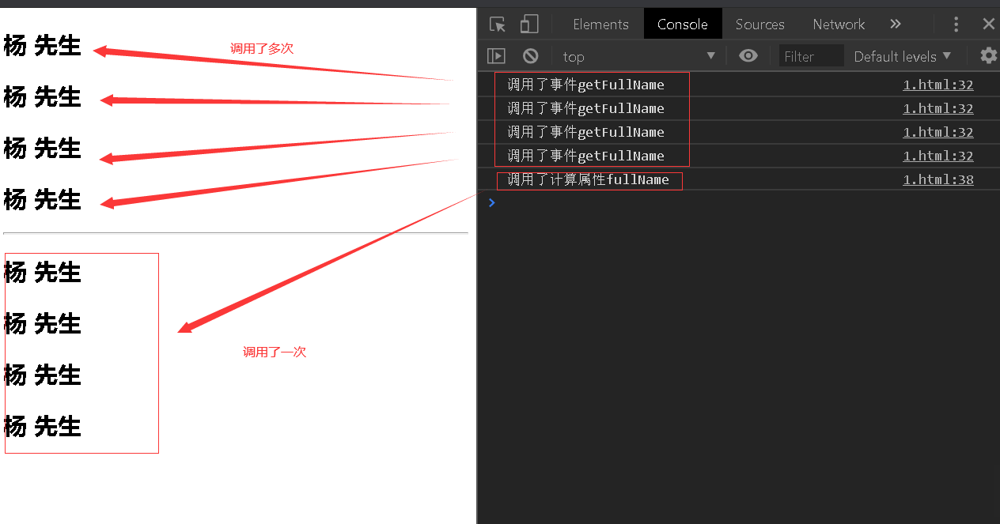
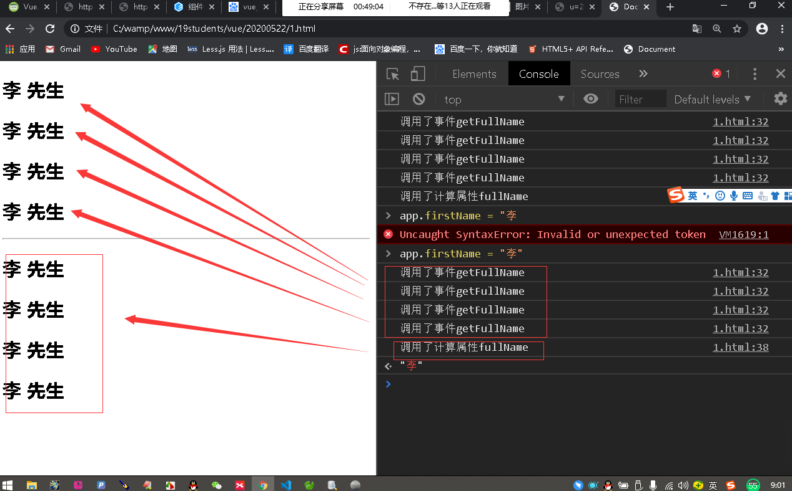
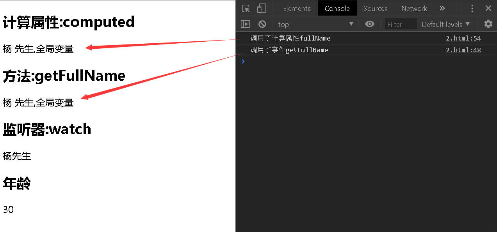
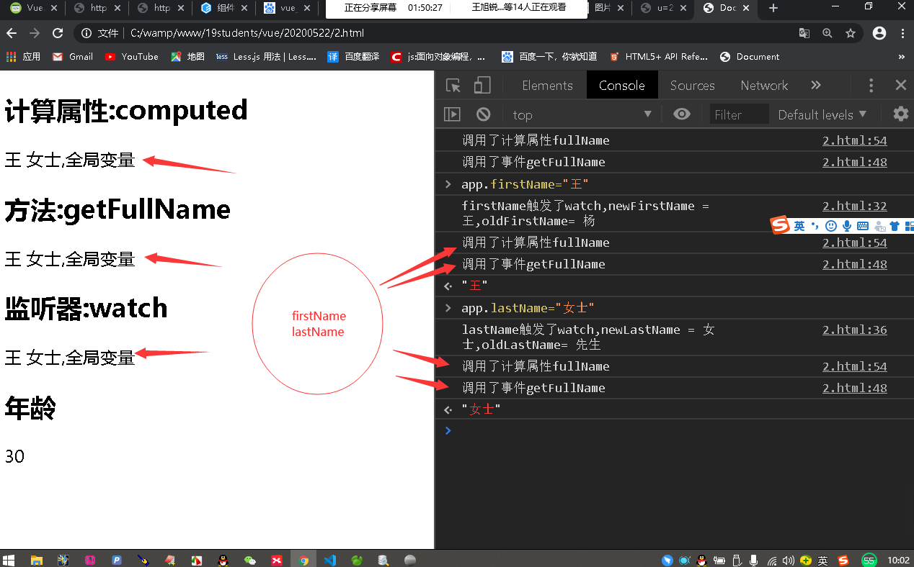
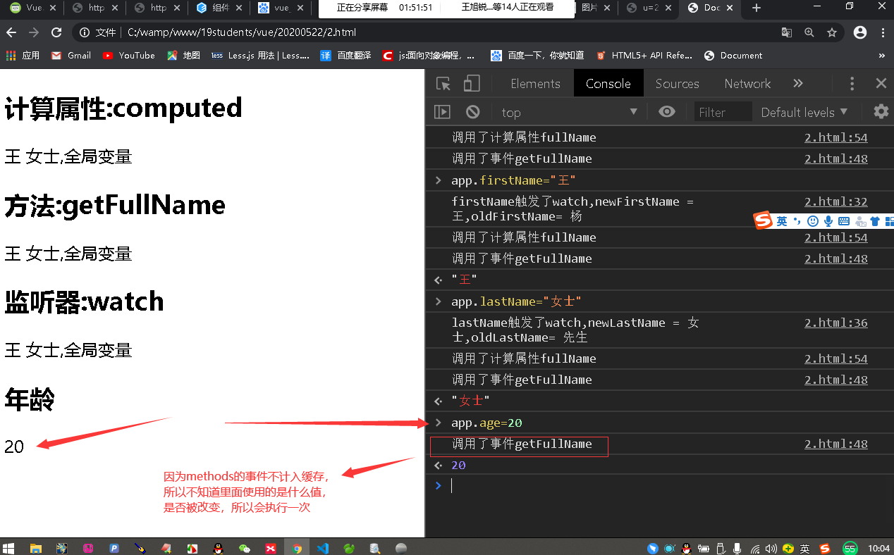
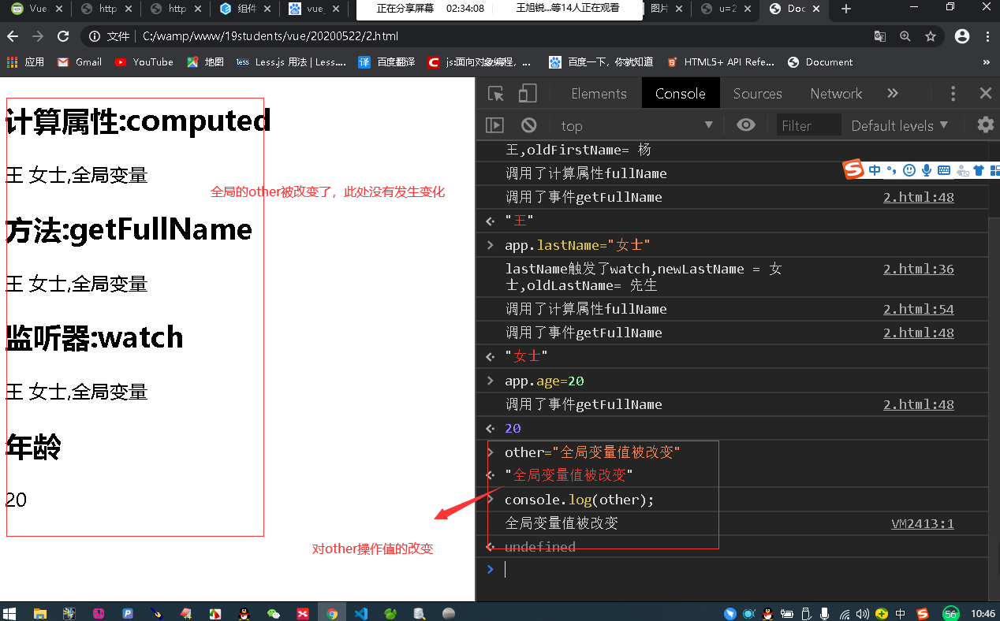
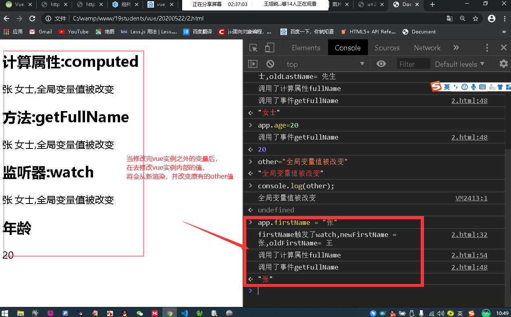

#1计算属性的基本使用
----
现在有变量姓氏和称谓，要得到完整的组合

```html
<!DOCTYPE html>
<html lang="en">
<head>
    <meta charset="UTF-8">
    <meta name="viewport" content="width=device-width, initial-scale=1.0">
    <script src="https://cdn.staticfile.org/vue/2.2.2/vue.min.js"></script>
    <title>Document</title>
</head>
<body>
    <div id="app">
        <p>姓名:{{firstName + " " + lastName}}</p>
        <p>姓名:{{getFullName()}}</p>
        <p>姓名:{{fullName}}</p>
    </div>
    <script>
        const app = new Vue({
            el:"#app",
            data:{
                firstName:"杨",
                lastName:"老师"
            },
            methods:{
                getFullName(){
                    return this.firstName +" "+ this.lastName
                }
            },
            //在使用计算属性定义的方法时，不需要使用()即可执行方法，获取结果
            computed:{//计算属性 定义方法
                fullName(){
                    return this.firstName +" "+ this.lastName
                }
            }
        })
    </script>
</body>
</html>
```
1)使用差值表达式语法去拼接`<p>姓名:{{firstName + " " + lastName}}</p>`
2)使用方法methods : `<p>姓名:{{getFullName()}}</p>`
3)使用计算属性computed: `<p>姓名:{{fullName}}</p>`

> 例子中计算属性computed看起来和方法似乎一样，只是方法调用时，需要使用()，而计算属性不需要.方法取名字一般是动词(见名知义)，而计算属性是名词。

#   2.计算属性的复杂用法:
----
```js
    books:[
        {id:1,name:"三国演义",price:80},
        {id:2,name:"水浒传",price:100},
        {id:3,name:"西游记",price:85},
        {id:4,name:"红楼梦",price:120}
    ]
```

```html
<!DOCTYPE html>
<html lang="en">
<head>
    <meta charset="UTF-8">
    <meta name="viewport" content="width=device-width, initial-scale=1.0">
    <script src="https://cdn.staticfile.org/vue/2.2.2/vue.min.js"></script>
    <title>Document</title>
</head>
<body>
    <div id="app">
        <h2>总价格:{{getTotalPrice()}}</h2>
        <h2>总价格:{{totalPrice}}</h2>
    </div>
    <script>
        const app = new Vue({
            el:"#app",
            data:{
                books:[
                    {id:1,name:"三国演义",price:80},
                    {id:2,name:"水浒传",price:100},
                    {id:3,name:"西游记",price:85},
                    {id:4,name:"红楼梦",price:120}
                ]
            },
            methods:{
                getTotalPrice(){
                    let result = 0;
                    for(let i = 0; i < this.books.length;i++){
                        result += this.books[i].price
                    }
                    return result
                }
            },
            computed:{
                totalPrice(){
                    let result = 0;
                    for(let i = 0; i < this.books.length;i++){
                        result += this.books[i].price
                    }
                    return result
                }
            }
        })
    </script>
</body>
</html>
```

# 3.计算属性的setter和getter
-----
计算属性中其实是由两个方法组成的setter和getter

```js
    computed:{
        fullName:{
            get(){//用于获取数据的，一般执行计算属性时，默认执行的都是get

            },
            set(newValue){//可以用于设置fullName的值，newValue就是设置的新值

            }
        }
        
    }
```
在正常情况下，我们只使用computed计算属性中的fullName方法时,也只是使用了get方法而已，set方法几乎不使用

> 如何使用set方法
```html
<!DOCTYPE html>
<html lang="en">
<head>
    <meta charset="UTF-8">
    <meta name="viewport" content="width=device-width, initial-scale=1.0">
    <script src="https://cdn.staticfile.org/vue/2.2.2/vue.min.js"></script>
    <title>Document</title>
</head>
<body>
    <div id="app">
        <p>称呼:{{fullName}}</p>
        <p>姓:{{firstName}}</p>
        <p>称呼:{{lastName}}</p>
    </div>
    <script>
        const app = new Vue({
            el:"#app",
            data:{
                firstName:"杨",
                lastName:"老师"
            },
            computed:{
                // fullName(){//get
                //     return this.firstName +" "+ this.lastName
                // },
                fullName:{
                    //用来获取数据的
                    get(){
                        return this.firstName +" "+ this.lastName
                    },
                    // 可以手动改变app.fullName的值,值会被set函数接收
                    set(newValue){//newValue === 新设置的值
                        const val = newValue.split(" ")//["杨","先生"]
                        this.firstName = val[0]
                        this.lastName = val[1]
                    }
                    //在页面刷新数据后，可以在f12控制台中，设置app.fullName = "杨 先生",页面的数据会随着改变
                }
            }
        })
    </script>
</body>
</html>
```

>在页面中设置一个input，用于更改app.fullName的值，看其他值的改变
```html
<!DOCTYPE html>
<html lang="en">
<head>
    <meta charset="UTF-8">
    <meta name="viewport" content="width=device-width, initial-scale=1.0">
    <script src="https://cdn.staticfile.org/vue/2.2.2/vue.min.js"></script>
    <title>Document</title>
</head>
<body>
    <div id="app">
    <!-- 通过使用v-bind:value=""  v-on:input="事件" 的方式模拟v-model双向数据绑定 -->
        <input type="text" :value="msg" @input="changeValue">
        <button @click="setName">修改fullName的值</button>
        <p>称呼:{{fullName}}</p>
        <p>姓:{{firstName}}</p>
        <p>称呼:{{lastName}}</p>
        <p>{{name}}</p>
        <button @click="getName">获取name值</button>
    </div>
    <script>
        const app = new Vue({
            el:"#app",
            data:{
                firstName:"杨",
                lastName:"老师",
                msg:"1",
                name:""
            },
            computed:{
                // fullName(){
                //     return this.firstName +" "+ this.lastName
                // },
                fullName:{
                    //用来获取数据的
                    get(){
                        return this.firstName +" "+ this.lastName
                    },
                    // 可以手动改变app.fullName的值,值会被set函数接收
                    set(newValue){//newValue === 新设置的值
                        const val = newValue.split(" ")//["杨","先生"]
                        this.firstName = val[0]
                        this.lastName = val[1]
                    }
                    //在页面刷新数据后，可以在f12控制台中，设置app.fullName = "杨 先生",页面的数据会随着改变
                }
            },
            //用下面的几个方法，来演示在f12中修改app.fullName的值的改变
            methods:{
                getName(){
                    this.name = this.fullName
                },
                changeValue(event){//event对象
                    console.log(event.target);  
                    this.msg =  event.target.value
                },
                setName(){
                    this.fullName = this.msg;
                }
            }
        })
    </script>
</body>
</html>
````


#   4.计算属性和menthods的对比

``` html
<!DOCTYPE html>
<html lang="en">
<head>
    <meta charset="UTF-8">
    <meta name="viewport" content="width=device-width, initial-scale=1.0">
    <script src="https://cdn.staticfile.org/vue/2.2.2/vue.min.js"></script>
    <title>Document</title>
</head>
<body>
    <div id="app">
        <!-- 事件执行渲染 -->
        <h2>{{getFullName()}}</h2>
        <h2>{{getFullName()}}</h2>
        <h2>{{getFullName()}}</h2>
        <h2>{{getFullName()}}</h2>
        <hr>
        <!-- 计算属性执行渲染 -->
        <h2>{{fullName}}</h2>
        <h2>{{fullName}}</h2>
        <h2>{{fullName}}</h2>
        <h2>{{fullName}}</h2>
    </div>
    <script>
        const app = new Vue({
            el:"#app",
            data:{
                firstName:"杨",
                lastName:"先生"
            },
            methods:{
                getFullName(){
                    console.log("调用了事件getFullName");
                    return this.firstName +" "+this.lastName    
                }
            },
            computed:{
                fullName(){
                    console.log("调用了计算属性fullName");
                    return this.firstName +" "+this.lastName
                }
            }
        })
    </script>
</body>
</html>
````

分别使用方法和计算属性获取四次fullName,结果如图:



由此可见计算属性有缓存，在`this.firstName + " " + this.lastName`的属性值不变的情况下，methods调用了4次，而计算属性掉了一次，在性能上计算属性明显比methods好，而在改动firstName的情况下，计算属性只调用一次，methods依然要调用4次  

  


#   5.Vue计算属性和监听器(侦听器)
----
```html
<!DOCTYPE html>
<html lang="en">
<head>
    <meta charset="UTF-8">
    <meta name="viewport" content="width=device-width, initial-scale=1.0">
    <script src="https://cdn.staticfile.org/vue/2.2.2/vue.min.js"></script>
    <title>Document</title>
</head>
<body>
    <div id="app">
        <h2>计算属性:computed</h2>
        {{fullName}}
        <h2>方法:getFullName</h2>
        {{getFullName()}}
        <h2>监听器:watch</h2>
        {{wacthFullName}}
        <h2>年龄</h2>
        {{age}}
    </div>
    <script>
        const other = "全局变量";
        const app = new Vue({
            el:"#app",
            data:{
                firstName:"杨",
                lastName:"先生",
                age:30,
                wacthFullName:'杨先生'
            },
            watch:{
                firstName(newFirstName,oldFirstName){
                    console.log("firstName触发了watch,newFirstName = "+newFirstName + ",oldFirstName= "+oldFirstName);
                    this.wacthFullName = this.firstName + " " + this.lastName + ","+ other
                },
                lastName(newLastName,oldLastName){
                    console.log("lastName触发了watch,newLastName = "+newLastName + ",oldLastName= "+oldLastName);
                    this.wacthFullName = this.firstName + " " + this.lastName + ","+ other
                },
                wacthFullName(/*新值,旧值*/){

                },
                age(){

                }
            },
            methods:{
                getFullName(){
                    console.log("调用了事件getFullName");
                    return this.firstName +" "+this.lastName +","+  other 
                }
            },
            computed:{
                fullName(){
                    console.log("调用了计算属性fullName");
                    return this.firstName +" "+this.lastName +","+  other 
                }
            }
        })
    </script>
</body>
</html>
```

>初始化  (图1)
    

>修改firstName和lastName,两者都修改  (图2)
  

当每一个数据进行变化的时候，methods和computed都会对应的执行,wacth中相对应的监听事件也会被执行


>修改methods和computed中没有使用的age (图3)


methods的事件会被调用。而computed里面的计算事件是没有被使用的，因为计算属性在使用后会被存储到缓存内。当计算属性的使用的值被改变，才会从新调用计算属性的方法，否则方法不会被再次使用.  
而methods里面的事件不被存储到缓存内，不能记录所使用的data数据，当data数据有改变时，methods的方法不知道是否有当前事件内的值被改变，所以只能再次运行一下，避免出现值改变事件没执行的问题.如果没有改变，无非就是多运行一次事件

>vue实例之外的对象 other  (图4)


修改other的值，页面不会从新渲染，只有值被改变

>修改vue实例之外的对象后，在去修改vue实例内的对象  (图5)


因为vue实例的值有修改，所以会从新渲染页面，一并修改了页面中other的值


>测试结论:
+   使用computed计算了fullName属性,值为firstName + lastName + other ，计算属性具有`缓存功能`,当firstName和lastName都不改变的时候，fullName不会从新计算，例如图3
+   methods并没有缓存功能,比如我们修改age的值，getFullName()方法会被执行，例图3
+   当一个功能，可以用上面三个方法来实现的时候,使用computed更加合适，代码简单还有缓存性

> 计算属性:computed计算属性范围 在Vue实例的fullName内所管理的firstName和lastName,它通常可以监听多个值.

> 监听器(侦听器)：watch监听数据变化，一般只监听一个变量或者数据对象的变化
> 使用场景:watch(异步场景), computed(数据联动)